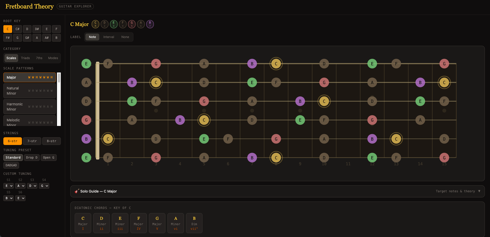

# Fretboard Theory

An interactive guitar music theory learning application — built for guitarists 
who want to understand the neck, not just memorise patterns.



**[Live Demo →](#)** *(coming soon)*

---

## What It Does

Fretboard Theory makes music theory visual and interactive. Instead of 
reading about scales in a book, you see them mapped across the entire neck 
in real time — in any key, on any string configuration.

- **Visual Fretboard** — colour-coded note dots across 15 frets, 6/7/8 string support
- **30+ Scale & Mode Patterns** — Major, Minor, all 7 Modes, Pentatonic, Blues, 
  Diminished, Whole Tone and more
- **Triads & 7th Chords** — every chord type mapped across the neck
- **Key Triads View** — see all diatonic chords for any key on specific string sets
- **Solo Guide** — for every scale and mode, learn which notes are strongest 
  to land on when improvising, with music theory explanations and practice tips
- **Diatonic Chord Grid** — the 7 chords in your key, click any to jump to 
  that chord's triad on the fretboard
- **Custom Tuning** — Standard, Drop D, Open G, DADGAD, or dial in any 
  tuning per string

---

## Why I Built This

Most theory tools are either static chord charts or complex DAW plugins. 
There's nothing in between that teaches you *why* certain notes work over 
certain chords — and shows it on the actual instrument.

This project is also a deliberate exercise in building a real product 
with proper engineering practices: typed data models, unit tests, 
state management, CI/CD, and a phased roadmap — not just a prototype.

---

## Tech Stack

| Concern | Technology |
|---------|-----------|
| Framework | React 18 + TypeScript |
| Build tool | Vite 5 |
| Styling | Tailwind CSS v4 |
| State | Zustand |
| Testing | Vitest + React Testing Library |
| Hosting | Vercel |

---

## Running Locally

```bash
# Clone the repo
git clone https://github.com/shaikzaiduddin/fretboard-theory.git
cd fretboard-theory

# Install dependencies
npm install

# Start the dev server
npm run dev
# → opens at http://localhost:5173
```

**Requirements:** Node v18 or higher

---

## Project Structure

src/
├── components/       # UI components
│   ├── Fretboard/    # SVG fretboard renderer + draw hook
│   ├── Sidebar/      # Key grid, pattern list, string config
│   └── SoloGuide/    # Theory panel + strength map
├── data/             # Music theory data (scales, tunings, solo guides)
├── hooks/            # useFretboard — computes note positions from state
├── stores/           # Zustand stores (theory state, UI state)
├── tests/            # Unit tests — 49 passing
└── types/            # TypeScript interfaces

---

## Testing

```bash
npm test              # watch mode
npm run test:coverage # coverage report
```

49 tests covering all music theory calculation logic, data integrity, 
and state management. Theory functions are tested independently of the UI — 
`normalise()`, `noteName()`, `buildNoteSet()`, scale data structure 
validation, tuning preset correctness, and Zustand store behaviour.

---

## Roadmap

This project follows a phased delivery model. Each phase ships a working, 
deployed product.

| Phase | Status | Description |
|-------|--------|-------------|
| 1 — Foundation | ✅ Complete | React migration, all theory features, full test suite |
| 2 — Visual Polish | ⬜ Planned | PixiJS WebGL fretboard, Framer Motion animations |
| 3 — Audio Input | ⬜ Planned | Real-time pitch detection from guitar via audio interface |
| 4 — Quiz Engine | ⬜ Planned | Random progressions, play and be evaluated |
| 5 — Chord Detection | ⬜ Planned | Python FastAPI backend, librosa FFT chord analysis |
| 6 — AI Companion | ⬜ Planned | LLM-powered practice suggestions and solo analysis |

---

## Architecture Decisions

Key decisions documented as Architecture Decision Records (ADRs):

- **React + TypeScript** over plain JavaScript — type safety across a 
  complex music theory data model catches entire categories of bugs at 
  compile time
- **Zustand** over Redux — same power, zero boilerplate, selective 
  re-renders by default
- **SVG fretboard** now, **PixiJS WebGL** in Phase 2 — SVG is debuggable 
  and correct; WebGL is needed for 60fps animations with audio input
- **Pitchy (browser)** for single-note pitch detection — McLeod Pitch 
  Method, < 50ms latency, no backend required
- **FastAPI Python** for chord detection (Phase 5) — Python's audio 
  ecosystem (librosa, aubio) is significantly more capable than 
  JavaScript alternatives for FFT analysis

Full documentation: [`CONTEXT.md`](./CONTEXT.md)

---

## What I Learned Building This

- Structuring a growing React codebase with clear separation between 
  data, state, hooks, and components
- Writing tests that catch real bugs — including bugs in the tests themselves
- How Zustand's selector pattern prevents unnecessary re-renders
- The difference between `useMemo` dependencies that are needed vs. redundant
- Why TypeScript strict mode pays dividends as complexity grows
- Setting up a professional CI/CD pipeline with automated deploys

---

## Documentation

| Document | Description |
|----------|-------------|
| [`CONTEXT.md`](./CONTEXT.md) | Full project context — data structures, architecture, roadmap |
| `FretboardTheory_BRD_TRD_v1.0.docx` | Business & Technical Requirements Document |

---

## License

MIT

---

*Built by [Zaid](https://github.com/shaikzaiduddin) — 2026*